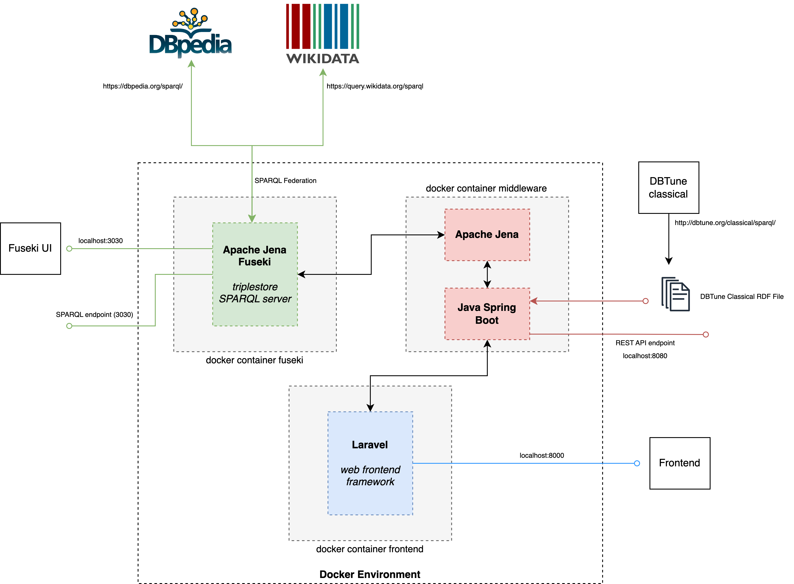
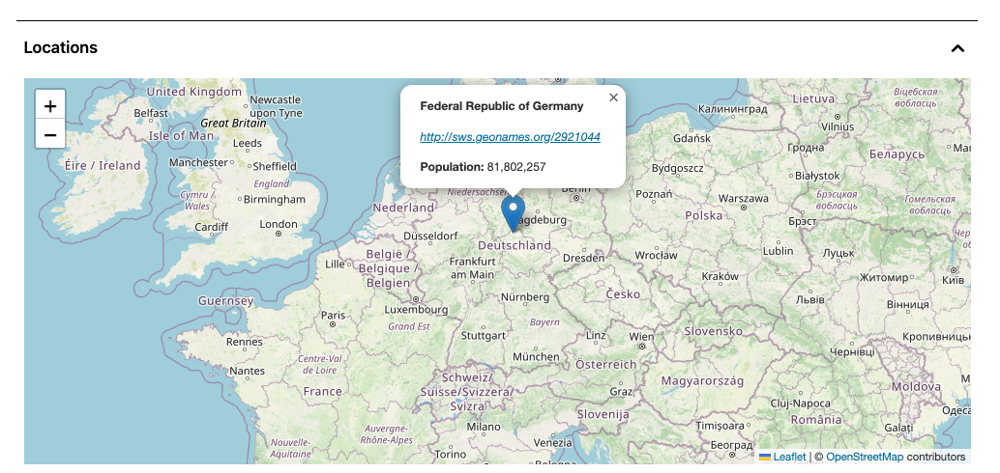
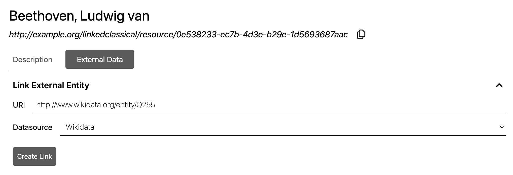
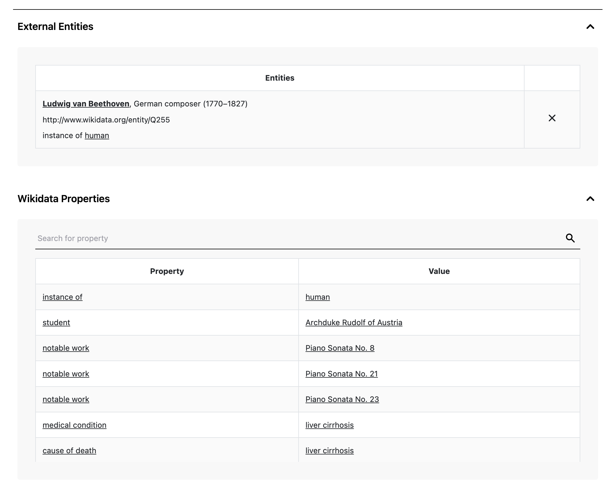

# Linked Classical

This repository contains the infrastructure developed for a linked data application in the context of classical music, Linked Classical. The application uses [a dataset from DBTune Classical](http://dbtune.org/classical/) as the base knowledge base, and allows for its expansion through SPARQL federation. This work was developed in the context of Tiago Gomes's [M.EIC](https://sigarra.up.pt/feup/en/cur_geral.cur_view?pv_curso_id=22862) master's dissertation, entitled "Federation Solutions for Linked Data Applications", and in the context of the [EPISA project](https://episa.inesctec.pt/). The main goals are the evaluation of federation solutions, interaction with linked data, and the development of a template for linked data applications.

## Architecture

The application is composed by three main components: an [Apache Jena Fuseki](https://jena.apache.org/documentation/fuseki2/index.html) triplestore, a [Java Spring Boot](https://spring.io/projects/spring-boot) REST API and a [Laravel](https://laravel.com/) frontend. These components and its interactions are represented by the following architecture diagram:



## Class Diagram


## Physical Model Diagram


## Labels Architecture

To provide a human-readable version of a resource's name, new triples were created, with the following structure:

```<resource-uri> rdfs:label <label>```

The `label` field was defined according to the type of the resource:
- For composers, the label was derived from their names (`foaf:name`)
- For musical works, the label was derived from their titles (`dc:title`)
- For births and deaths, the label was derived from their dates (`ns5:date`)

## URIs Architecture

Even though all the resources in the knowledge base were already identified by URIs, defined by DBTune, there was a necessity to define new ones. The Linked Classical URIs were added to the dataset by creating new triples, with the following structure:

``` <linked-classical-URI> owl:sameAs <dbtune-URI> ```

Note that the `owl:sameAs` property states that the subject and the object are the same resource. In this way, the Linked Classical URIs are associated with the respective resources.

The Linked Classical URIs follow the following structure:

``` http://example.org/linkedclassical/resource/<uuid> ```

Note that `uuid` is a generated universal unique identifier. To avoid an unnecessary parsing of the generated URIs, these generated identifiers were linked to the respective resource by creating triples with the following form:

``` <resource-uri> rdf:id <uuid> ```

These universal unique identifiers are used by the routes of the frontend application:
- [https://example.org/linkedclassicalclient/resource/&lt;uuid>](https://example.org/linkedclassicalclient/resource/&lt;uuid>)
- [https://example.org/linkedclassicalclient/composer/&lt;uuid>](https://example.org/linkedclassicalclient/composer/&lt;uuid>)
- [https://example.org/linkedclassicalclient/musicalWork/&lt;uuid>](https://example.org/linkedclassicalclient/musicalWork/&lt;uuid>)


## SPARQL Federation

### Composer's Geographical Insights

To take advantage of the existence of URIs pointing to external knowledge bases on our dataset, we use federation techniques to retrieve additional information about a resource, particularty for composers. As an example, the location of a composer, present in our dataset as a geonames URI, is shown to the user as follows:



The following SPARQL query was used to retrieve the necessary information:

```SPARQL
PREFIX rdf: <http://www.w3.org/1999/02/22-rdf-syntax-ns#>
PREFIX foaf: <http://xmlns.com/foaf/0.1/>
PREFIX gn: <http://www.geonames.org/ontology#>
PREFIX wgs84_pos: <http://www.w3.org/2003/01/geo/wgs84_pos#>

SELECT ?location ?latitude ?longitude ?locationName ?locationPopulation
WHERE {
  ?composer rdf:id "0bde8c6b-6695-47b8-933b-01aa4c53cc74" .
  ?composer foaf:based_near ?location .
  SERVICE <http://linkedgeodata.org/sparql> {
    ?location wgs84_pos:lat ?latitude ;
    wgs84_pos:long ?longitude ;
    gn:name ?locationName .
    OPTIONAL { ?location gn:population ?locationPopulation . }
  }
}
```

Note the usage of the `SERVICE` keyword, from SPARQL 1.1, to query a remote SPARQL endpoint. Having the coordinates of the location, we use [Leaflet](https://leafletjs.com/) to display a map with all the locations associated with a composer. When the user clicks a location, additional information, such as its name and population, can be seen.

### Integration with External Datasets

Within the Linked Classical application, a collaborative section within composer pages invites user engagement through the association of external resource that are the same as the respective composer resource. This collaboration results in the seamless integration of fresh insights, thereby enriching the interface’s informational landscape.



The user chooses the external resource URI and its datasource and the application integrates new information retrieved from that datasource:



## Requirements

To run the application, you need to have [docker](https://www.docker.com/) and [git](https://git-scm.com/) installed on your machine.

## Setup

The first step for the setup of the application is to clone this repository:

```git clone git@github.com:feup-infolab/linked-classical.git```

To run the application, run on the root of the repository:

```./setup.sh```

To stop the application, run on the root of the repository:

```./stop.sh```

## Usage

After starting the application, the following services will be available:

- Apache Jena Fuseki dashboard, available at `http://localhost:3030`
- Sprint Boot REST API, available at `http://localhost:8080`
- Laravel frontend, available at `http://localhost:8000`

## Demo

https://github.com/feup-infolab/linked-classical/assets/50210213/e541df93-ea21-4e66-a1e3-f1ed4c943847
